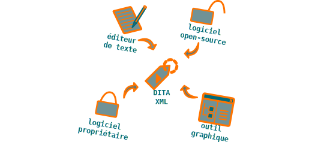

Lorsqu'une entreprise décide d'industrialiser la rédaction technique,
elle se pose d'emblée la question des outils. Or, plutôt que les
outils, ce sont les formats sous-jacents qui sont le point essentiel.

La plupart des éditeurs, afin de disposer d'un marché captif obligé de
régulièrement payer des mises à jour de leurs produits, ont en effet
développé des formats propriétaires que seuls leurs logiciels sont à
même de modifier. Un fichier MS Word ou un fichier FrameMaker ne peuvent
ainsi être modifiés que *via* les outils éponymes. Choisir un tel format
risque donc de limiter les choix ultérieurs de l'entreprise et de se
révéler coûteux : il faut une licence par utilisateur, qu'il soit
rédacteur technique, contributeur occasionnel ou traducteur.

Si l'on réfléchit en termes de formats, en revanche, il est possible de
mettre en place des solutions évolutives. Un format ouvert tel que
[OpenDocument](http://fr.wikipedia.org/wiki/OpenDocument) ou DITA
XML, par exemple (seul le second étant un format industriel de rédaction
technique), n'est pas lié à un outil donné. Il est donc possible de le
modifier et de le manipuler à l'aide de différents logiciels. Les
formats structurés de type DocBook et DITA XML liés à un schéma XSD
normalisée peuvent notamment être facilement gérés, de la création à la
publication, à l'aide de toute une panoplie d'outils, de l'éditeur de
texte libre à la suite logicielle propriétaire et graphique.
