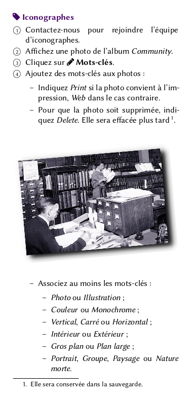
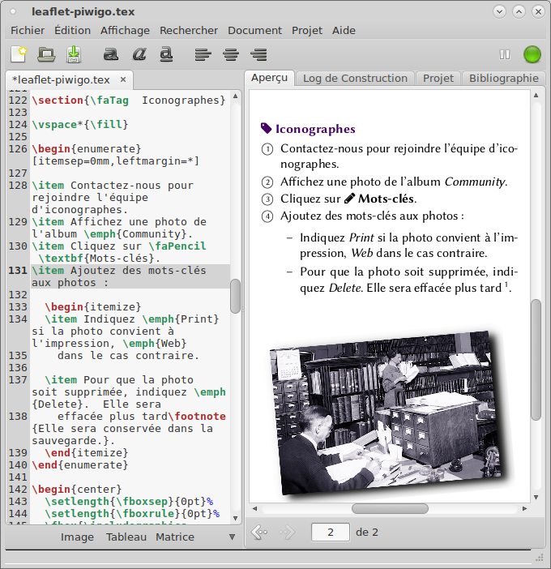

Pourquoi avoir choisi \[LaTeX\](<https://www.latex-project.org/> pour
réaliser le support *print* et non pas un logiciel de PAO classique ? Je
souhaitais pouvoir remanier le texte sans refaire à chaque fois la mise
en page. De même, je voulais pouvoir traduire le dépliant sans effectuer
de tâche de PAO manuelle.

Voici un exemple de code LaTeX :

``` tex
\section{\faTag  Iconographes}

\vspace*{\fill}

\begin{enumerate}[itemsep=0mm,leftmargin=*]

   \item Contactez-nous pour rejoindre l'équipe d'iconographes.
   \item Affichez une photo de l'album \emph{Community}.
   \item Cliquez sur \faPencil  \textbf{Mots-clés}.
   \item Ajoutez des mots-clés aux photos :

     \begin{itemize}
       \item Indiquez \emph{Print} si la photo convient à l'impression, \emph{Web}
         dans le cas contraire.
       \item Pour que la photo soit supprimée, indiquez \emph{Delete}.  Elle sera
         effacée plus tard\footnote{Elle sera conservée dans la sauvegarde.}.
     \end{itemize}

\end{enumerate}

\begin{center}
  \setlength{\fboxsep}{0pt}%
  \setlength{\fboxrule}{0pt}%
  \fbox{\includegraphics[angle=5,width=\linewidth]{iconographes}}%
\end{center}
```

Le rendu PDF est illustré ci-dessous. Remarquez le calcul automatique
des césures (qui a fait l\'objet d\'une \[thèse de
doctorat\](<https://texfaq.org/FAQ-hyphen>). C\'est l\'un des \`nombreux
avantages
de\[LaTeX\]([https://www.latex-project.org/\\](https://www.latex-project.org/\)
...



:::: note
::: title
Note
:::

Les fervents du *WYSIWYG* se tourneront avec profit vers
\[Gummi\](<https://github.com/alexandervdm/gummi>. Il s\'agit de *What
you see is what you get* au sens strict (et plutôt de *tel écran, tel
imprimé* que de *tel écran, tel écrit*). On ne peut en effet pas
modifier le texte dans la fenêtre de visualisation, uniquement dans la
fenêtre de code LaTeX. Vous savez donc exactement ce qui se passe « sous
le capot » et avez une plus grande maîtrise qu\'en déléguant la création
du code de mise en page à une interface graphique. Si vous manipulez
souvent des listes numérotées et que vous avez été confronté à des
numérotations, disons... aléatoires, vous en comprendrez tout de suite
l\'avantage.


::::

D\'autre part, une fois la structure du dépliant créée, il est facile de
l\'utiliser pour produire rapidement d\'autres documents. De plus, le
document peut être remanié par d\'autres personnes sans problème de
licence ou de plateforme logicielle.
