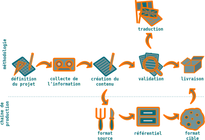
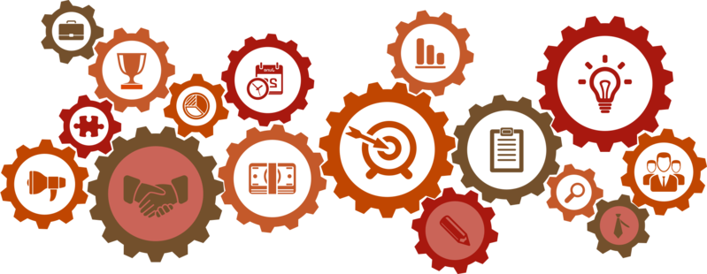
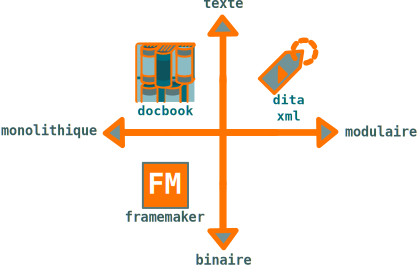
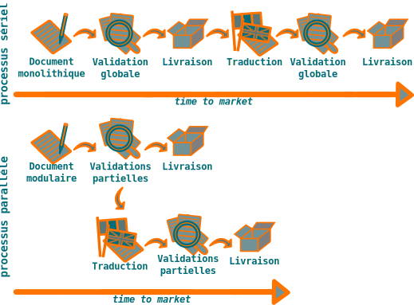

La rédaction technique repose sur des processus rationnels. Trop souvent
associée à un fort aspect littéraire, elle est fréquemment laissée à
l'improvisation et à l'inspiration du rédacteur technique. Le
rédacteur technique, comme les autres intervenants de l'entreprise,
doit répondre à ses objectifs de manière prévisible et reproductible.

Ce processus repose sur une méthodologie rigoureuse et une chaîne de
production fiable.

Pour créer et valoriser un contenu à forte valeur ajoutée pour
l'entreprise, le rédacteur technique dialogue constamment non seulement
avec tous les acteurs internes de la société, mais aussi avec son
écosystème : partenaires, journalistes, utilisateurs, etc. Il fournit
ainsi aux différents publics l'information dont ils ont besoin. Ceci
renforce l'image de marque de la société, améliore la satisfaction
client et facilite la perception des avantages produit par les
prospects. Le rédacteur technique s'appuie sur une chaîne de production
aussi automatisée que possible. En mettant en place un processus
industriel et reproductible, il diminue les coûts de production et
fournit un niveau de qualité constant, adapté aux buts de l'entreprise.

## Une documentation en microservices

L'heure est aux microservices, dans le secteur du logiciel, mais la
documentation est toujours très monolithique. Stocker l'information de
base dans différents référentiels, et générer à la demande une
documentation selon le profil unique de chaque utilisateur
faciliterait pourtant grandement l'accès rapide aux informations
utiles.

Après une maintenant longue expérience en rédaction technique, j'en
arrive à penser que beaucoup de rédacteurs sont trop attachés à
l'aspect rédactionnel de leur métier.

Non que ce soit une mauvaise chose en soi, loin de là, mais il
faudrait réserver cet aspect aux domaines où il apporte le plus de
valeur ajoutée, par exemple en :

- sélectionnant des informations à communiquer à l'audience cible,
  dans une approche [minimaliste](https://www.instructionaldesign.org/theories/minimalism/) ;

- présentant le produit selon la [perspective de l'utilisateur](https://www.utwente.nl/en/bms/ist/minimalism/principle2/) ;

- concevoir et tester des procédures aussi simples et didactiques
  que possible.

Hors les parties purement conceptuelles d'une documentation, je pense
qu'un certain idéal consisterait à construire un document structuré à
partir de diverses sources externes à la documentation proprement
dite.

Par exemple, une liste de plateformes supportées peut être maintenue
par un ingénieur qualité dans une source unique, telle qu'un fichier
CSV, YAML, une base de données, ou une application de gestion de
projets telle que Redmine, puis être interrogée au moment où la
documentation est compilée.

De plus, il est souvent plus pertinent de masquer les informations
inutiles que de laisser l'utilisateur chercher l'information dont il a
besoin dans une masse de données qui ne seront pour lui que du
bruit. Il est facile de croiser l'extraction de données de multiples
sources avec l'application de conditions. La syntaxe des moteurs de
*templates* tels que Liquid ou Jinja est très lisible et efficace, par
exemple, `` débute
une partie de texte destinée uniquement aux utilisateurs utilisant un
produit du modèle *3xr* en version *11.0* ou ultérieure.

Cela permet à chacun de se consacrer à son domaine d'expertise,
diminue nettement les efforts de mise à jour, améliore l'exactitude
des informations fournies, et garantit la meilleure fiabilité possible
aux utilisateurs.

Noyer des informations factuelles dans une masse de texte peut
transformer en cauchemar la maintenance de la documentation. Le
principe DRY (Don't Repeat Yourself) qui prévaut en
programmation s'applique également en rédaction technique.

### Apporter de la valeur ajoutée

Ce genre de processus peut s'opposer à des résistances de la part des
rédacteurs techniques, qui préfèrent parfois se positionner en tant
que seuls détenteurs de l'information. On peut cependant penser que
leur rôle n'est pas de conserver, mais de diffuser l'information, sous
la forme la plus appropriée.

Il faut faire une nette différence entre *rédaction* et
*littérature*. La dimension technique de la rédaction technique est
primordiale. Tout d'abord dans le sens où il faut comprendre le
fonctionnement de ce que l'on décrit.  Et ensuite, dans celui où ce
métier a sa propre technicité, basée sur des études empiriques menées
sérieusement et facilement disponibles et utilisables. Se priver d'une
telle approche ne sert ni les utilisateurs, ni le rédacteur technique,
ni l'équipe à laquelle il appartient.

## Définition du projet

Un projet de rédaction technique apporte une valeur ajoutée aux produits
et aide l'entreprise à mieux commercialiser son offre sur son marché.
Mais, comme pour les projets de R&D ou de marketing, la définition du
projet permet d'en estimer le budget et les retombées.

Communiquer des informations techniques sans savoir à qui ni dans quel
but est un effort vain. Avant d'initier un projet de rédaction
technique, il est indispensable de clairement le définir. Il convient
notamment de déterminer :

| Catégorie           | Description                                                                 |
|---------------------|-----------------------------------------------------------------------------|
| **Son objectif**    | - Augmenter la notoriété de l'entreprise - Accroître sa couverture médias - Amener les prospects à prendre contact avec la société - Réduire les coûts de support technique... |
| **Sa cible**        | - Grand public - Journalistes - Prospects - Clients...            |
| **Sa forme**        | - Livre blanc - Mode d'emploi ou guide de l'utilisateur - Brochure et *flyer* - Site *web* - Magazine d'entreprise - *Print* ou *online*... |
| **Sa langue**       | Suivant votre domaine d'activité, le projet sera décliné en une ou plusieurs langues (principalement l'anglais dans le secteur informatique). |
| **Son mode de diffusion** | - Publication sur un site Internet/Extranet - Envoi sous forme de fichier joint par *mail* - Remise en mains propres au format papier... |

L'analyse des résultats du projet donne ensuite de précieux
renseignements pour améliorer encore l'impact des projets suivants.

## Collecte de l'information

Le rédacteur technique collecte l'information auprès de différentes
sources, internes et externes à l'entreprise.

Une fois le projet de rédaction technique clairement défini, le
rédacteur technique collecte toute l'information disponible :

-   spécifications du produit, Intranet, pages
    [Trac](http://trac.edgewall.org),
-   interview du service R&D,
-   manipulation du produit,
-   interview du service marketing,
-   interview de clients,
-   analyse de la concurrence,
-   lecture de la presse spécialisée.

Les informations doivent être recoupées pour minimiser le risque de
transmettre des informations erronées ou plus à jour. Le rédacteur
technique doit se livrer à un véritable travail d'enquête. En se
mettant à la place de l'utilisateur, il vérifie chaque information et
fait le tri entre les données pertinentes et celles qui ne seront que du
bruit perturbant le message.

Premier utilisateur des solutions développées par la société, le
rédacteur technique a le rôle du *candide* qui remet chaque aspect de
l'information à transmettre dans son contexte. Il peut par exemple
décider, contre l'avis de la direction technique, de passer sous
silence des informations très techniques dans le guide de
l'utilisateur. Inversement, il pourra étayer une brochure commerciale
de données techniques précises pour étayer le discours marketing.

## Tester les produits pour les documenter

Le rédacteur technique ne peut fournir une documentation utile aux
clients de l'entreprise s'il se contente de mettre en forme des
informations glanées auprès des différents acteurs de la société. Jouant
le rôle de Candide, il est le premier représentant des utilisateurs et
se doit de tester les produits dans des conditions proches des leurs.

Un conte chinois narre comment des aveugles se sont retrouvés confrontés
à un éléphant. Aucun d'entre eux, et pour cause, n'ayant une
perception globale de l'animal, chacun en eut une image différente :
celui qui en tenait une patte le prenait pour un arbre, celui qui en
étreignait la trompe le confondait avec un serpent, celui qui avait
empoigné une défense l'identifiait à une lance, et celui qui
s'agrippait à une de ses oreilles croyait qu'il s'agissait d'un
éventail.

Le rédacteur technique qui demande aux différents intervenants de
l'entreprise à quoi sert le produit dont il doit créer la documentation
et comment il fonctionne se retrouve comme celui qui demande aux
aveugles à quoi ressemble un éléphant : pour la R&D, il s'agit de code
élégamment rédigé, pour le marketing, d'une offre à positionner face à
la concurrence sur son marché, pour le support technique, d'un
exécutable dont il faut corriger les bugs, etc.

Pour avoir une vision réaliste de l'objet qu'il est censé décrire, le
rédacteur technique doit donc l'appréhender par lui-même et se faire sa
propre opinion, qu'il pourra ensuite confronter à celle des autres
acteurs de l'entreprise. Le rédacteur technique est un pragmatique qui
s'intéresse à la pratique, non à la théorie. S'il ne consulte que les
développeurs, par exemple, il aura peu de chance de pouvoir créer une
documentation satisfaisante pour l'utilisateur :

-   d'une part, les développeurs ont souvent une vision idéaliste du
    fonctionnement de leur produit, différente du comportement de ce
    dernier en conditions réelles d'utilisation,
-   d'autre part, une déperdition d'information se produit
    nécessairement entre :
    -   ce que le développeur sait,
    -   ce que le développeur exprime,
    -   ce que le rédacteur technique comprend,
    -   ce que le rédacteur technique rédige,
    -   ce que l'utilisateur comprend.

Si le rédacteur technique teste réellement le comportement du produit
dans des conditions aussi proches que possible de celles rencontrées par
l'utilisateur, les trois premières causes de déperdition d'information
sont quasiment inexistantes. Pour réduire les deux dernières, il ne lui
reste plus qu'à filtrer, organiser et exprimer l'information qu'il a
recueillie de manière adaptée au média qui la véhiculera et aux
connaissances techniques de son destinataire.

Dans les faits, une telle demande peut sembler de prime abord incongrue
en interne et se heurter à la lourdeur de la mise en place d'une
plateforme de test. Ce n'est généralement qu'après les premiers
retours clients ou les tests produits dans la presse que les différents
interlocuteurs comprennent pleinement l'apport de cette démarche.
C'est souvent seulement à partir de ce moment là que la rédaction
technique gagne ses lettres de noblesse. Et que la documentation
technique n'est plus seulement vue comme un mal nécessaire, mais comme
une véritable valeur ajoutée.

## Création du contenu

Le rédacteur technique crée le contenu du projet de rédaction technique
dans un dialogue constant avec les différents acteurs de la société :
services R&D, marketing. Il prend en compte en amont les différentes
contraintes liées au cycle de vie des supports de rédaction technique.

En particulier, le rédacteur technique a soin de :

-   faire valider le contenu à ses interlocuteurs afin d'apporter les
    modifications nécessaires aussi tôt que possible ; ceci garantit que
    le résultat sera conforme au projet initialement défini,
-   minimiser le volume de texte et d'images sources afin de réduire
    les coûts de production, de maintenance et de traduction,
-   prendre en compte dès le début du projet les contraintes
    d'internationalisation.

## Format source

Le contenu d'un projet de rédaction technique est créé dans un format
source, différent du format des livrables, le format cible. Pour
reprendre une image fréquemment utilisée en développement logiciel, le
format source est la recette de cuisine, le format cible, le plat. En
photographie, le format source est le format
[RAW](http://fr.wikipedia.org/wiki/RAW_(format_d%27image)), qui est
généré par l'appareil photo, et sur lequel les photographes
professionnels préféreront apporter les retouches, et le format cible,
le format JPEG.

Les traitements de texte nous ont déshabitués à distinguer le fond de la
forme. Mais confondre les deux entraîne beaucoup d'erreurs et de perte
de temps.

En effet, le document présenté à l'utilisateur présente deux aspects
fondamentaux :

-   le contenu,
-   la mise en page.

Au cours du développement d'une documentation technique, ces deux
aspects doivent être clairement distincts. Ils peuvent être pris en
charge par deux intervenants différents :

-   le rédacteur technique,
-   le graphiste.

Lorsque la mise en page a une importance équivalente à celle du contenu,
ou lorsqu'elle doit être variée, comme dans le cas d'une brochure
commerciale, la rédaction et la mise en page s'opèrent sous des outils
différents :

-   éditeur de texte,
-   logiciel de PAO, par exemple InDesign ou Scribus.

Lorsque la mise en page a une importance moindre que celle du contenu,
ou lorsqu'elle doit être homogène, comme dans le cas d'une
documentation technique, la rédaction et la mise en page s'opèrent
sur :

- les mêmes fichiers, par exemple, des fichiers FrameMaker,

- des fichiers différents, par exemple, des fichiers de contenu XML et
  une feuille de style XSLT.

Dans un fichier FrameMaker, la séparation du fond et de la forme est
élevée mais pas totale : le contenu et la mise en page sont placés dans
le même fichier. FrameMaker applique une maquette de page homogène à
tout un fichier, mais autorise l'ajout manuel d'éléments de mise en
page. La même maquette peut être dupliquée pour tout le document, ou une
maquette différente peut être utilisée pour chaque fichier qui compose
ce dernier.

Les formats sources peuvent être classés selon leur degré de modularité
et leur format de fichier.

Les formats XML structurés DocBook et DITA XML appliquent une maquette
de page homogène à tout un document, et n'autorisent pas l'ajout
manuel d'éléments de mise en page, ni l'application de maquettes
différentes aux différents fichiers qui composent le document.

| Format     | Application d'une mise en page homogène | Possibilité de mise en page manuelle |
|------------|-----------------------------------------|--------------------------------------|
| MS Word    | Non                                     | Oui                                  |
| FrameMaker | Oui                                     | Oui                                  |
| DITA XML   | Oui                                     | Non                                  |

Si contenu et mise en page sont intimement liés, comme sous un
traitement de texte, il est difficile de modifier le contenu sans
perturber la mise en page. Résultat : à chaque publication d'une
nouvelle version d'une documentation technique, l'équipe de rédaction
technique passe de longues heures à corriger les erreurs de mise en page
générées par le logiciel. Le phénomène est moindre sous FrameMaker mais
reste important. Il est nul avec les formats DITA XML et DocBook (les
seules erreurs qui peuvent se produire sont des erreurs de compilation
dues à une syntaxe XML erronée ; ces erreurs sont facilement
rectifiables).

Les fichiers sources d'une documentation technique sont au format :

-   binaire ou,
-   texte.

Ce format est également :

-   WYSIWYG ou,
-   structuré.

Enfin, ce format est :

-   modulaire ou,
-   monolithique.

Ce dernier aspect détermine la manière dont le format gère le
*single-sourcing* :

-   selon une logique *livre vers aide en ligne* ou,
-   selon une logique *aide en ligne vers livre*.

Les formats disponibles peuvent donc être classés selon le tableau
suivant :

| Format           | Texte | Structuré | Modulaire |
|------------------|-------|-----------|-----------|
| FrameMaker natif | Non   | Non       | Limité    |
| DocBook          | Oui   | Oui       | Limité    |
| DITA XML         | Oui   | Oui       | Oui       |

FrameMaker et DocBook ne sont pas pleinement modulaires, car les plus
petits éléments d'information manipulables ne sont pas génériques : ils
contiennent des informations telles que la structure de table des
matières ou les références croisées qui ne sont valables que dans un
nombre limité de contextes.

## Référentiel

Le contenu est le capital immatériel de la société et doit être protégé
comme tel. Il peut être géré dans différents référentiels : répertoires,
mais aussi outils de gestion de contenu d'entreprise et logiciels de
gestion de versions.

## Validation et contrôle qualité

Un support de rédaction technique doit être soumis à un contrôle qualité
rigoureux avant d'être communiqué à ses différentes cibles.

Le contenu doit être validé avant livraison. Cela paraît évident, mais
cela demande de bien impliquer en amont les personnes chargées de la
validation. Idéalement, la phase de validation se déroule en parallèle
de la phase de création : plus les modifications interviennent tôt,
moins elles sont coûteuses. Un outil de gestion de contenu d'entreprise
tel qu'[Alfresco](http://www.alfresco.com/fr) peut sembler
intéressant afin de mettre en place des *workflows*, sur le papier du
moins. Dans les faits, une telle solution peut s'avérer lourde. Elle
est de plus peu compatible avec certains formats sources basés sur des
documents modulaires et non monolithiques et avec les logiciels de
gestion de versions (le projet [Componize](http://www.componize.com)
se propose cependant de gérer des projets DITA XML sous Alfresco). Il
reste cependant impératif de mettre en place des étapes de validation
tout au long du projet. Associés à un système de gestion de versions,
les outils de comparaison sont très utiles pour valider les mises à
jour. Une version « taguée » d'un projet DITA XML et la version en
cours peuvent par exemple être exportées au format RTF, puis comparées
sous un traitement de texte. Cela est bien moins fastidieux qu'une
relecture comparée. Comparer les modules d'information directement sous
le système de gestion de versions n'est pas suffisant, car ils ne sont
que les « briques » du document final.

## Traduction

Les contraintes de traduction doivent être prises en compte en amont du
processus rédactionnel. Elles ont des implications autant sur le style
rédactionnel que sur l'organisation du référentiel.

Il n'y a pas de recette miracle : la livraison d'informations dans
plusieurs langues demande un suivi constant. Mais la prise en compte des
contraintes en amont et l'utilisation d'une méthodologie appropriée
permettent d'améliorer la qualité et de diminuer les coûts et les
délais de livraison des versions multilingues. La traduction doit être
intégrée au *workflow* documentaire. Il faut également faire communiquer
avec les traducteurs les différents acteurs : rédacteurs techniques,
mais également ingénieurs, experts et concepteurs.

Si la documentation repose sur un ensemble de modules, la traduction
peut se faire en parallèle de la rédaction, ce qui réduit les délais de
livraison.

En ce qui concerne le référentiel des fichiers sources, vaut-il mieux
placer les répertoires de langue en amont ou en aval des répertoires de
projets documentaires ? Autrement dit, vaut-il mieux adopter la
structure suivante :

-   english
    -   produit 1
    -   produit 2
-   francais
    -   produit 1
    -   produit 2

ou la suivante :

-   produit 1
    -   english
    -   francais
-   produit 2
    -   english
    -   francais

Dans la plupart des cas, il est préférable de placer la distinction
entre les langues le plus en amont possible. Pour reprendre une
terminologie utilisée dans le développement logiciel, créer une
traduction d'un ensemble d'informations équivaut à créer une *branche*
de cet ensemble. Comme il est plus facile de manipuler une branche par
sa racine que par ses ramifications, à l'usage, il est beaucoup plus
facile de manipuler des répertoires complets, ne serait-ce que pour les
fournir aux traducteurs, qu'un ensemble de sous-répertoires.

Une fois la traduction réalisée, les modifications apportées à la
version source ou à la version traduite ne peuvent être appliquées
automatiquement à l'autre version. Pour continuer dans la terminologie
du monde logiciel, la nouvelle branche est un *fork* : il devient
impossible d'appliquer automatiquement à l'une les modifications
apportées à l'autre. Pour fournir les mêmes informations dans les
différentes langues, il est donc crucial de suivre efficacement les
mises à jour de la version d'origine.

## Format cible

Le format cible d'un support de rédaction technique est celui sous
lequel l'audience du message y accédera. Il est différent de celui sous
lequel le rédacteur technique crée le contenu. Le *single-sourcing*
permet de générer plusieurs livrables à des formats différents à partir
d'un même format source.

À partir des fichiers sources validés, les livrables sont générés selon
l'une des méthodes suivantes :

| Niveau d’automatisation  | Exemple                                                                                                                                                       |
|--------------------------|---------------------------------------------------------------------------------------------------------------------------------------------------------------|
| Totalement automatique   | Par exemple, livre blanc du format structuré DITA XML au format cible PDF *via* DITA Open Toolkit.                                                            |
| Semi automatique         | Par exemple, contenu au format DITA XML exporté en HTML puis collé sous un Content Management System.                                                         |
| Manuelle                 | Par exemple, plaquette marketing au format traitement de texte ou DITA XML mise en page sous Indesign, exportée en PDF, puis imprimée ; selon la fréquence de publication du document final, des filtres d'import XML peuvent également être mis en place. |

Plus le processus est automatisé, plus le risque d'erreur est faible et
plus la publication et la mise à jour sont aisées. L'automatisation
facilite également le *single-sourcing*, qui consiste à générer
plusieurs livrables à des formats cibles différents à partir d'un même
format source. Un projet au format DITA XML peut ainsi être livré sous
forme de fichier PDF, d'aide compilée Windows, d'aide JavaHelp, de
site en HTML, etc. Le XML offre en ce domaine des possibilités quasi
illimitées.

## Livraison

Le rédacteur technique livre le document à son destinataire de la
manière appropriée :

-   animation publiée sur un site de streaming,
-   plaquette distribuée dans les salons ou laissée en clientèle par les
    ingénieurs commerciaux,
-   journaux envoyés aux clients,
-   site Internet mis à jour,
-   document mis en ligne en PDF ou distribué sous forme de guide
    imprimé...
