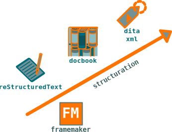

Réduire les coûts, raccourcir les délais de publication et améliorer la qualité : voilà les défis actuels du rédacteur technique. Une solution efficace consiste à limiter le volume de contenu source et à mieux gérer l'information.

L'information destinée au public doit être redondante pour s'adapter à chaque support et à chaque type d'utilisateur. Mais en interne, cette redondance génère des coûts, ralentit la production et nuit à la cohérence.

Pour y remédier, il faut structurer le contenu en modules uniques, standardisés et réutilisables. Ces briques d'information peuvent ensuite être assemblées selon les besoins.

DITA XML est un format de rédaction modulaire conçu pour cela. Il permet de produire différents livrables (PDF, site web, e-learning, etc.) à partir d'une base commune de contenus, selon le même principe que la fabrication industrielle à partir de pièces standard.
