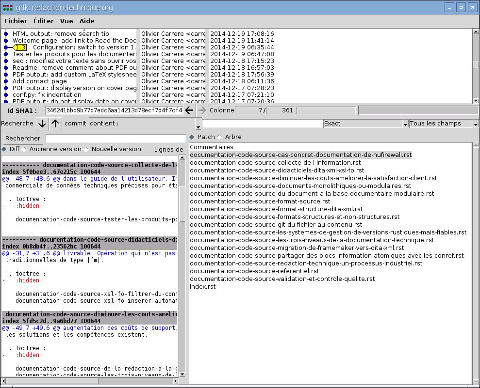

1.  *Commitez* votre lot de modifications sous Git :

    ``` console
    $ git config --global user.email "votre email"
    $ git config --global user.name "votre nom"
    $ git add *.rst
    $ git commit -m "Mon lot de modifications de texte"
    $ git add graphics/*.svg
    $ git commit -m "Mon lot de modifications sur les images"
    ```

2.  Affichez l'historique des modifications des sources de ce blog :

    ``` console
    $ gitk &
    ```

    Ô surprise, vous avez sous les yeux, mais oui, une Graphical User
    Interface ! C'est tellement beau, qu'on va faire une photo :

    

    *Un* commit *atomique s'étendant sur une bonne quinzaine de
    fichiers*

: note
 title
Note


-   Vos modifications sont purement locales et ne sont pas appliquées
    sur le dépot distant GitHub.
-   Si vos modifications apportent une réelle valeur ajoutée à ce blog
    (correction de coquille, ajout d'information ou autre), n'hésitez
    pas à me la soumettre sous forme de patch Git ou *via* votre compte
    GitHub.
-   GitHub n'est probablement pas hébergé sur un cluster de
    Raspberry Pi 3. Rien n'empêche cependant d'héberger un dépôt
    distant Git sur un Raspberry Pi 3 connecté au réseau et d'y accéder
    par connexion sécurisée SSH.
:
